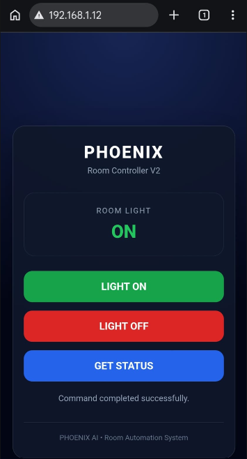
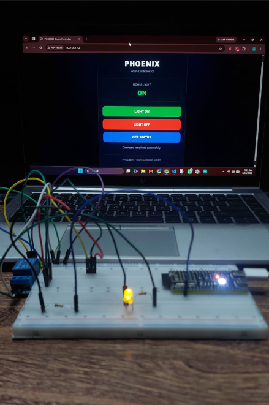
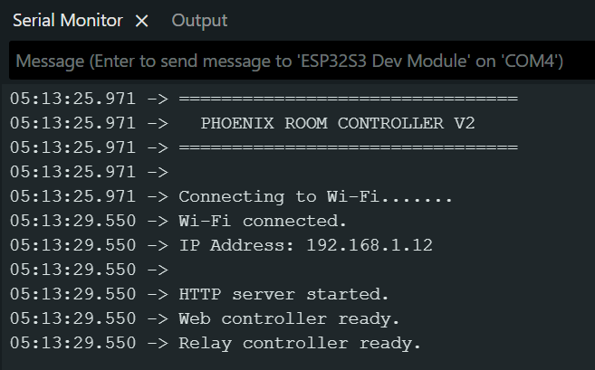

# PHOENIX Room Controller

A modular Wi-Fi room-control system built with Python and ESP32-S3.

The project is part of the larger **PHOENIX AI / JARVIS ecosystem** and is being developed as a reusable physical-room control module.

Version 1 established the basic Python-to-ESP32 Wi-Fi control path using an LED.

Version 2 upgrades the system with a real relay-based switching layer, physical low-voltage load control, and a responsive web interface accessible from both desktop and mobile devices.

---

## Current Version

**PHOENIX Room Controller v2.0.0**

```text
Python CLI ───────────┐
                      │
Laptop Browser ───────┼──── HTTP / Wi-Fi
                      │
Mobile Browser ───────┘
                              │
                              ▼
                          ESP32-S3
                              │
                           GPIO 4
                              │
                              ▼
                            BC547
                              │
                              ▼
                         HW-307 Relay
                              │
                           COM / NO
                              │
                              ▼
                       5V Physical Load
```

---

## Features

### Software Control

- Python-based command-line controller
- Responsive ESP32-hosted web interface
- Desktop browser control
- Mobile browser control
- HTTP-based communication
- JSON API
- Connection and timeout handling
- Local ESP32 IP configuration

### Hardware Control

- ESP32-S3 Wi-Fi controller
- BC547 transistor interface
- HW-307 5V relay module
- Physical relay switching
- Normally Open load control
- Safe low-voltage LED load testing
- Relay state reporting
- Safe startup state

### Web Interface

The ESP32 directly hosts the PHOENIX control interface.

The dashboard provides:

- LIGHT ON
- LIGHT OFF
- GET STATUS
- Live ON/OFF state display
- Responsive mobile layout
- Connection feedback

No separate web server is required.

---

## Version Evolution

### V1.0.0

```text
Python CLI
    ↓
HTTP / Wi-Fi
    ↓
ESP32-S3
    ↓
GPIO
    ↓
LED
```

Version 1 proved the fundamental software-to-hardware communication path.

### V2.0.0

```text
Python CLI / Web UI / Mobile UI
              ↓
          HTTP / Wi-Fi
              ↓
          ESP32-S3
              ↓
           GPIO 4
              ↓
            BC547
              ↓
         HW-307 Relay
              ↓
          COM / NO
              ↓
      Physical 5V Load
```

Version 2 introduces a reusable switching layer capable of controlling physical electrical loads through a relay.

---

## Demo

### Mobile PHOENIX Dashboard

<p align="center">
  
</p>

### Relay and Physical Load Control

<p align="center">
  
</p>

### ESP32-S3 Network Server

<p align="center">
  
</p>

---

## Hardware Requirements

- ESP32-S3
- HW-307 single-channel 5V relay module
- BC547 NPN transistor
- 1kΩ resistor
- LED
- 330Ω resistor
- Breadboard
- Jumper wires
- Regulated 5V supply
- Wi-Fi network

---

## Hardware Architecture

The relay module is powered from a regulated 5V supply.

The ESP32 does not directly drive the relay input. A BC547 transistor is used as the interface between the ESP32 GPIO and the active-LOW relay module.

```text
ESP32 GPIO 4
      │
     1kΩ
      │
      ▼
 BC547 Base

BC547 Collector
      │
      ▼
 Relay IN

BC547 Emitter
      │
      ▼
 Common GND
```

The tested control behavior is:

```text
ESP32 GPIO HIGH
      ↓
BC547 ON
      ↓
Relay IN pulled LOW
      ↓
Relay ON
```

and:

```text
ESP32 GPIO LOW
      ↓
BC547 OFF
      ↓
Relay OFF
```

---

## Relay Power Wiring

```text
External +5V  ───────→ Relay VCC

External GND  ───────→ Relay GND
                  ├──→ ESP32 GND
                  └──→ BC547 Emitter
```

The 5V supply powers the relay module.

The ESP32 and relay control circuit share a common ground.

> Always verify the transistor pinout for the specific BC547 device being used before wiring.

---

## Low-Voltage Load Wiring

Version 2 uses a safe 5V LED load for switching tests.

```text
External +5V
     │
     ▼
    COM
     │
   Relay
     │
     NO
     │
    330Ω
     │
     ▼
 LED Anode (+)

 LED Cathode (-)
     │
     ▼
External GND
```

`NO` means **Normally Open**.

Therefore:

```text
Relay OFF
→ COM and NO disconnected
→ Load OFF
```

```text
Relay ON
→ COM and NO connected
→ Load ON
```

The `NC` terminal is not used in the current version.

---

## Project Structure

```text
Phoenix-Room-Controller/
│
├── docs/
│   └── images/
│       ├── v2-mobile-dashboard.png
│       ├── v2-relay-light-on.png
│       └── v2-serial-monitor.png
│
├── hardware/
│   ├── __init__.py
│   ├── room_controller.py
│   │
│   └── esp32_room_controller/
│       ├── esp32_room_controller.ino
│       ├── secrets.example.h
│       └── secrets.h
│
├── main.py
├── config.example.json
├── config.json
├── requirements.txt
├── .gitignore
└── README.md
```

The following local files are intentionally excluded from Git:

```text
.venv/
config.json
secrets.h
```

---

## Software Requirements

- Python 3
- Arduino IDE
- ESP32 Arduino board support
- Python `requests` package

Install dependencies with:

```bash
python -m pip install -r requirements.txt
```

---

# Setup

## 1. Clone the Repository

```bash
git clone https://github.com/Muhammad-Ahsan14/Phoenix-Room-Controller.git
cd Phoenix-Room-Controller
```

---

## 2. Create a Python Virtual Environment

Windows:

```powershell
python -m venv .venv
.\.venv\Scripts\Activate.ps1
```

Install dependencies:

```powershell
python -m pip install -r requirements.txt
```

---

## 3. Configure Wi-Fi Credentials

Inside:

```text
hardware/esp32_room_controller/
```

copy:

```text
secrets.example.h
```

to:

```text
secrets.h
```

Then configure:

```cpp
#pragma once

const char* WIFI_SSID = "YOUR_WIFI_NAME";
const char* WIFI_PASSWORD = "YOUR_WIFI_PASSWORD";
```

`secrets.h` must not be committed to Git.

---

## 4. Upload ESP32 Firmware

Open:

```text
hardware/esp32_room_controller/esp32_room_controller.ino
```

in Arduino IDE.

Select the correct:

- ESP32-S3 board
- COM port

Upload the firmware.

Open Serial Monitor at:

```text
115200 baud
```

Successful startup looks similar to:

```text
================================
  PHOENIX ROOM CONTROLLER V2
================================

Connecting to Wi-Fi...
Wi-Fi connected.
IP Address: 192.168.1.12

HTTP server started.
Web controller ready.
Relay controller ready.
```

---

## 5. Configure the Python Controller

Copy:

```text
config.example.json
```

to:

```text
config.json
```

Enter the IP address reported by the ESP32:

```json
{
  "esp32_ip": "192.168.1.12"
}
```

`config.json` is intentionally excluded from Git.

---

# Python CLI

Run:

```powershell
python main.py
```

The application displays:

```text
================================
   PHOENIX ROOM CONTROLLER V2
================================
1. Light ON
2. Light OFF
3. Get Light Status
4. Exit
```

The CLI follows a clean interaction flow:

```text
Menu
 ↓
Select Action
 ↓
Menu Clears
 ↓
Result
 ↓
Press Enter to return to menu...
 ↓
Menu
```

Example:

```text
Light turned ON.
Relay State: ON

Press Enter to return to menu...
```

---

# Web Controller

Once the ESP32 is connected to Wi-Fi, open:

```text
http://ESP32_IP
```

Example:

```text
http://192.168.1.12
```

The ESP32 serves the web interface directly.

The interface includes:

```text
LIGHT ON
LIGHT OFF
GET STATUS
```

The same page works on desktop and mobile browsers connected to the same local network.

---

## Mobile Control

Connect the phone to the same Wi-Fi network as the ESP32.

Then open:

```text
http://ESP32_IP
```

in the mobile browser.

No laptop is required for web-based control once the ESP32 is running.

---

# HTTP API

Version 2 exposes the following endpoints:

| Endpoint | Purpose |
|---|---|
| `/` | Responsive PHOENIX web interface |
| `/health` | Device availability check |
| `/light/on` | Turn relay/light ON |
| `/light/off` | Turn relay/light OFF |
| `/light/status` | Return current commanded state |

---

## Health Endpoint

```text
GET /health
```

Example response:

```json
{
  "success": true,
  "device": "PHOENIX Room Controller V2",
  "status": "online"
}
```

---

## Light ON

```text
GET /light/on
```

Example:

```json
{
  "success": true,
  "light": "ON",
  "relay": "ON"
}
```

---

## Light OFF

```text
GET /light/off
```

Example:

```json
{
  "success": true,
  "light": "OFF",
  "relay": "OFF"
}
```

---

## Status

```text
GET /light/status
```

Example:

```json
{
  "success": true,
  "light": "ON",
  "relay": "ON"
}
```

---

# Error Handling

If the ESP32 is powered off, disconnected from Wi-Fi, or otherwise unreachable, the Python application exits cleanly instead of crashing.

Example:

```text
Starting PHOENIX Room Controller V2...
Connecting to ESP32 at 192.168.1.12...

Connection failed.
Could not connect to PHOENIX device.
```

HTTP request timeouts are also handled by the Python controller.

---

# Current State Reporting

Version 2 reports the **commanded relay state**.

For example:

```text
Light Status: ON
Relay State: ON
```

means PHOENIX commanded the relay into its ON state.

It does not yet independently verify through a sensor that the physical load actually illuminated.

Physical feedback and verification can be added in later versions.

---

# Safety

Version 2 intentionally uses a **low-voltage 5V load** for development and testing.

Do not connect ESP32 GPIO pins directly to mains voltage.

Do not treat breadboard-level prototypes as mains-ready systems.

Future versions that control real room lighting must use:

- Properly rated relay/switching hardware
- Electrical isolation
- Suitable enclosures
- Appropriate wire ratings
- Fuses/protection where required
- Safe mains wiring practices
- Qualified supervision where applicable

The current version is a low-voltage development prototype.

---

# Learning Outcomes

Version 2 develops experience with:

- ESP32-S3 networking
- Embedded HTTP servers
- REST-style APIs
- Python HTTP clients
- Responsive embedded web interfaces
- Mobile device control
- Relay modules
- Active-LOW control
- NPN transistor switching
- BC547 interfacing
- Physical load switching
- Hardware abstraction
- Configuration management
- Secret management
- Error handling
- Git branching and versioning
- Software-hardware integration

---

# Roadmap

## V1.0.0

- Python CLI
- ESP32 Wi-Fi communication
- HTTP API
- LED control
- State reporting
- Error handling

**Status: Complete**

---

## V2.0.0

- Relay integration
- BC547 transistor interface
- Physical low-voltage load switching
- Python control
- Desktop web control
- Mobile web control
- Responsive ESP32-hosted dashboard
- Health endpoint
- Relay state reporting

**Status: Current Release**

---

## V3

Planned direction:

- Real room-device control
- Safer isolated switching architecture
- Improved device configuration
- Better state/status handling
- Failure detection
- Expansion beyond a single test load

---

## V4

Planned direction:

- Multi-device abstraction
- Improved network architecture
- Device gateway concepts
- MQTT integration where appropriate
- Scalable room-device communication

---

# Future PHOENIX Integration

The Room Controller is responsible only for physical-room control.

Other PHOENIX modules remain separate capabilities.

Future architecture:

```text
User
 ↓
Voice Module
 ↓
Tool Engine
 ↓
Room Controller
 ↓
Device Network
 ↓
Physical Environment
```

Eventually the mature Room Controller will be integrated into **JARVIS**, the primary PHOENIX AI assistant.

---

# Development Philosophy

The Room Controller is developed as a standalone PHOENIX module.

Each version expands the same project rather than creating separate repositories.

```text
Build
 ↓
Test
 ↓
Break
 ↓
Fix
 ↓
Improve
 ↓
Document
 ↓
Release
 ↓
Integrate
```

Stable versions remain preserved through Git tags and GitHub releases.

---

# Author

**Muhammad Ahsan**

Computer Engineering  
COMSATS University Islamabad, Lahore Campus

GitHub: `Muhammad-Ahsan14`

---

# Operation-1000

This project is part of **Operation-1000**, a long-term engineering journey focused on building practical systems across AI, automation, software, embedded systems, and product development.