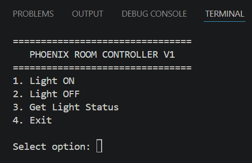
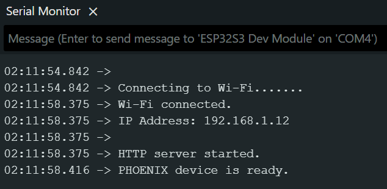
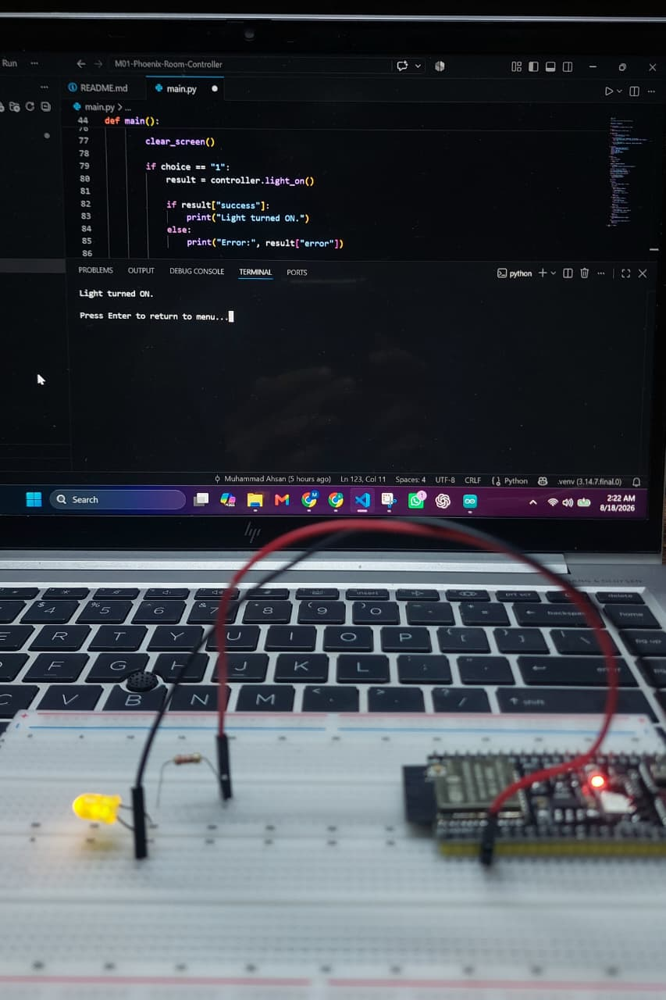
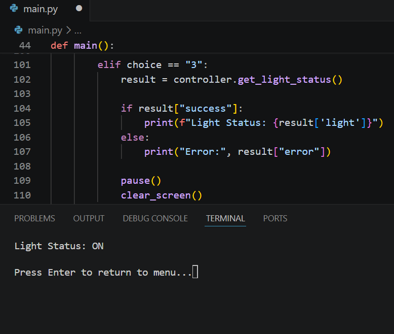

# PHOENIX Room Controller

A Wi-Fi based room-control module built with Python and ESP32-S3.

This project is part of the larger **PHOENIX AI / JARVIS ecosystem** and serves as the first standalone room-control module. Version 1 demonstrates communication between a Python application and physical hardware over Wi-Fi using HTTP.

## Version 1

The current version controls an LED connected to an ESP32-S3 from a Python CLI application.

```text
Python CLI
    ↓
HTTP over Wi-Fi
    ↓
ESP32-S3
    ↓
GPIO
    ↓
LED
```

## Features

- Python-based terminal controller
- ESP32-S3 Wi-Fi connectivity
- HTTP communication between computer and ESP32
- Turn light ON
- Turn light OFF
- Read current light status
- Device connection checking
- Timeout and connection-error handling
- Local configuration for ESP32 IP address
- Wi-Fi credentials excluded from Git
- Clean CLI workflow

## Demo

### 1.PHOENIX Room Controller CLI

<p align="center">
  
</p>

### 2.ESP32-S3 Network Connection

<p align="center">
  
</p>

### 3.Physical Light Control

<p align="center">
  
</p>

### 4.Live Device Status

<p align="center">
  
</p>
## CLI

```text
================================
   PHOENIX ROOM CONTROLLER V1
================================
1. Light ON
2. Light OFF
3. Get Light Status
4. Exit
```

After an action is performed, only the result is displayed.

```text
Light turned ON.

Press Enter to return to menu...
```

Pressing Enter returns to the main menu.

## Hardware

- ESP32-S3
- LED
- 220Ω or 330Ω resistor
- Breadboard
- Jumper wires
- Wi-Fi network

## Wiring

```text
ESP32-S3 GPIO 4
       │
       │
     220Ω
       │
       ▼
   LED Anode (+)

   LED Cathode (-)
       │
       ▼
      GND
```

## ESP32 API

The ESP32 runs a lightweight HTTP server.

Available endpoints:

| Endpoint | Purpose |
|---|---|
| `/` | Check whether the PHOENIX device is online |
| `/light/on` | Turn the LED ON |
| `/light/off` | Turn the LED OFF |
| `/light/status` | Get the current LED state |

Example response:

```json
{
  "success": true,
  "light": "ON"
}
```

## Project Structure

```text
Phoenix-Room-Controller/
│
├── hardware/
│   ├── __init__.py
│   ├── room_controller.py
│   │
│   └── esp32_room_controller/
│       ├── esp32_room_controller.ino
│       ├── secrets.example.h
│       └── secrets.h
│
├── main.py
├── config.example.json
├── config.json
├── requirements.txt
├── .gitignore
└── README.md
```

`config.json`, `secrets.h`, and the virtual environment are intentionally excluded from Git.

## Software Requirements

- Python 3
- Arduino IDE
- ESP32 board support for Arduino
- Python `requests` package

Install Python dependencies:

```bash
pip install -r requirements.txt
```

## Setup

### 1. Clone the repository

```bash
git clone <repository-url>
cd Phoenix-Room-Controller
```

### 2. Create a Python virtual environment

Windows:

```powershell
python -m venv .venv
.\.venv\Scripts\Activate.ps1
```

### 3. Install dependencies

```powershell
python -m pip install -r requirements.txt
```

### 4. Configure Wi-Fi

Inside:

```text
hardware/esp32_room_controller/
```

copy:

```text
secrets.example.h
```

to:

```text
secrets.h
```

Then add your Wi-Fi credentials:

```cpp
#pragma once

const char* WIFI_SSID = "YOUR_WIFI_NAME";
const char* WIFI_PASSWORD = "YOUR_WIFI_PASSWORD";
```

Do not commit `secrets.h`.

### 5. Upload ESP32 firmware

Open:

```text
hardware/esp32_room_controller/esp32_room_controller.ino
```

in Arduino IDE.

Select the correct ESP32-S3 board and COM port, then upload the sketch.

Open Serial Monitor at:

```text
115200 baud
```

After connecting successfully, the ESP32 prints its local IP address.

Example:

```text
Wi-Fi connected.
IP Address: 192.168.1.12

HTTP server started.
PHOENIX device is ready.
```

### 6. Configure the Python application

Copy:

```text
config.example.json
```

to:

```text
config.json
```

Then enter the IP address reported by the ESP32:

```json
{
  "esp32_ip": "192.168.1.12"
}
```

`config.json` is ignored by Git.

### 7. Run the controller

```powershell
python main.py
```

## Connection Failure Handling

If the ESP32 is powered off, disconnected, or unreachable, the application exits gracefully instead of crashing.

Example:

```text
Starting PHOENIX Room Controller...
Connecting to ESP32 at 192.168.1.12...

Connection failed.
Could not connect to PHOENIX device.
```

## What Version 1 Demonstrates

Version 1 proves the complete software-to-hardware communication path:

```text
Computer
   ↓
Python
   ↓
HTTP
   ↓
Wi-Fi Network
   ↓
ESP32-S3
   ↓
GPIO
   ↓
Physical Output
```

This communication layer will later evolve into a larger PHOENIX smart-room system.

## Roadmap

### V1

- Python CLI
- Wi-Fi / HTTP communication
- ESP32-S3
- LED control
- Live state reporting
- Connection handling

### V2

- Relay integration
- Safe low-voltage switching
- Hardware abstraction improvements

### V3

- Real room-device control
- Improved device status
- Failure handling
- Configuration improvements
- Safe isolated switching for real lighting

### V4

- Multiple device abstraction
- Networking improvements
- Device gateway / MQTT integration where appropriate

## Future PHOENIX Integration

The Room Controller remains responsible for physical-room control.

Other PHOENIX modules will provide separate capabilities.

```text
Voice Module
     ↓
Tool Engine
     ↓
Room Controller
     ↓
ESP32
     ↓
Relay / Device
```

Eventually these modules will be integrated into **JARVIS**, the primary PHOENIX AI assistant.

## Safety

Version 1 uses a low-voltage LED for development and testing.

Do not directly connect ESP32 GPIO pins to mains electricity.

Future mains-powered room-device versions must use properly rated and electrically isolated switching hardware and appropriate electrical safety practices.

## Learning Outcomes

This version covers:

- ESP32 Wi-Fi programming
- HTTP servers on embedded hardware
- Python HTTP requests
- JSON responses
- Software-hardware integration
- Modular Python design
- Configuration management
- Secret management
- Error handling
- Git-based project development

## Project Vision

PHOENIX Room Controller is designed to evolve from a simple network-controlled LED into a reusable room-control layer capable of controlling real devices through the larger PHOENIX ecosystem.

The long-term architecture is:

```text
User
  ↓
JARVIS
  ↓
PHOENIX Tool / Automation Layer
  ↓
Room Controller
  ↓
Device Network
  ↓
Physical Environment
```

## Author

**Muhammad Ahsan**

Computer Engineering  
COMSATS University Islamabad, Lahore Campus

GitHub: `Muhammad-Ahsan14`

## Operation-1000

This project is part of **Operation-1000**, a long-term engineering journey focused on building practical systems across AI, automation, software, and embedded hardware.